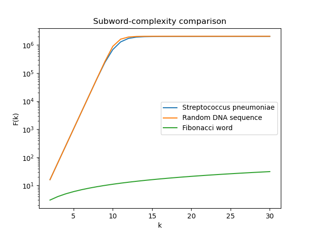

\centering
# BOX, HW1
\raggedright

The script can be run with the following command :

```bash
python3 hw1.py
```


## A secret genome

By running a nucleotide BLAST search, we find that the sequence matches the species : Streptococcus pneumoniae. We can assume that this prediction is reliable based on two parameters. First, the Query Cover measures the aligned portion of the substring which is 100% here. Then, the Percent Identity measures the proportion of matching bases in the aligned substring, which is also 100%.

Our query uses a 2979 substring length.

## Parsing the genome sequence

Because the contigs are not contiguous, we do not concatenate them directly to avoid creating artificial junctions. Instead, we extract the substrings of length $k$ from each contig into a single set, taking their union so that shared substrings across contigs are counted only once for the whole genome.

## Comparing the three subword-complexity functions



In order to visualize small values alongside the rapid curve growth, we use a logarithmic scale on the y-axis.

We observe that the subword-complexity of the Fibonacci word is lower than for the two other sequences, which is expected by construction: the same substitution rules are repeatedly applied when generating the sequence.

The curves for the bacterial genome and the random sequence are almost indistinguishable. Because the genome is so large, its subword complexity behaves very similarly to random noise at this scale. Both curves grow quickly for small values of $k$ until $k \approx 12\text{-}13$. At $k = 12$, there are nearly 17 million possible substrings ($4^{12}$), which exceeds the approximately 2 million positions available in the sequence. Consequently, substrings become long enough to be almost all unique in the text.