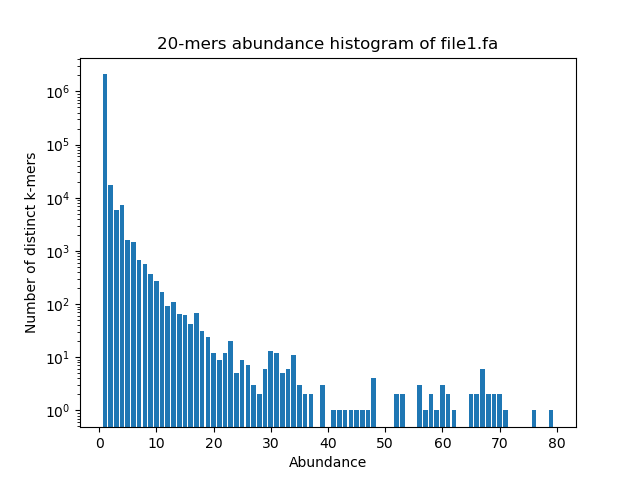

\centering
# BOX, HW2
\raggedright

## Ambiguity

For some reads, there is an ambiguous letter "N". We decide to not include k-mers with such letter.

## Measures on several files

Using the provided ```readfq``` method, we got the following results:

```bash
File 1 : 1 sequence(s), cumulative length : 2221315
File 2 : 1 sequence(s), cumulative length : 29903
File 3 : 1 sequence(s), cumulative length : 9181
File 4 : 7 sequence(s), cumulative length : 2553358
File 5 : 1 sequence(s), cumulative length : 29706
File 6 : 1 sequence(s), cumulative length : 213008
```

File 1 appears to be a complete bacterial genome represented by a single sequence of approximately 2.2 million base pairs. Similarly, File 4 presents a comparable length (about 2.55 million bp) but is split across 7 sequences. The other files consist of single sequences of varying smaller lengths: around 10 to 213 thousands of base pairs. It represents smaller sequences or fragments, may be it is smaller genomes like viruses (some thousands of bases).

## NCBI BLAST investigation
Using the NCBI BLAST tool, we found out the matching species for each file:
1. Streptococcus pneumoniae
2. Severe acute respiratory syndrome coronavirus 2
3. Human immunodeficiency virus 1
4. Streptococcus hyointestinalis
5. Severe acute respiratory syndrome coronavirus 2
6. Streptococcus suis

## Jaccard indexes

The Jaccard index indicates how similar the two sets of k-mers are for a given pair of files. Some files do not share any 20-mers. $J(1, 2)$ and $J(1, 6)$ are significantly low, their 20-mers sharing are due to randomness. $J(1, 4)$ and 

$J(4, 6)$ show a higher similarity. This reflects a true relationship: these files belong to different species of the same bacterial genome (Streptococcus). It is worth noting that $J(1, 6)$ is surprisingly low for bacteria of the same genus. This is a mathematical bias rather than a biological one: because File 6 is only a small fragment, its intersection with the complete genome of File 1 is naturally limited. Meanwhile, the union remains massive, which heavily pulls the Jaccard index down. Finally, $J(2, 5)$ is remarkably high. This confirms our BLAST results, proving that both files contain genomes from the exact same viral species.

Jaccard indexes : 
$J(1,2) = 9.170324097594257e-07$

$J(1,4) = 0.0033671891497898485$

$J(1,6) = 2.638133971251148e-05$

$J(2,5) = 0.8285967186166345$

$J(4,6) = 0.08781022348438079$

$J(1,3) = J(1,5) = J(2,3) = J(2,4) = J(2,6) = J(3,4) = J(3,5) = J(3,6) = J(4,5) = J(5,6) = 0$

## About canonical k-mers

Because DNA has a double-helix structure, a sequencing read only captures one of the two strands. However, due to base complementarity (A pairs with T, and C pairs with G), knowing one strand allows us to easily deduce the other. To avoid the bias of counting a sequence and its reverse complement as two distinct entities, we compute the reverse complement for each k-mer and keep only the lexicographically smaller one.

## Abundance histogram
The histogram shows that almost all 20-mers appear only once in the sequence (notice that the scale is logarithmic). This indicates that most k-mers are unique within the genome. As abundance increases, the number of distinct k-mers drops drastically: only a very small number of sequences occur multiple times, which corresponds to repeated elements in the DNA sequence.


