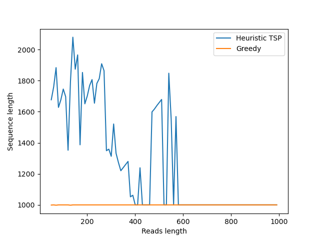
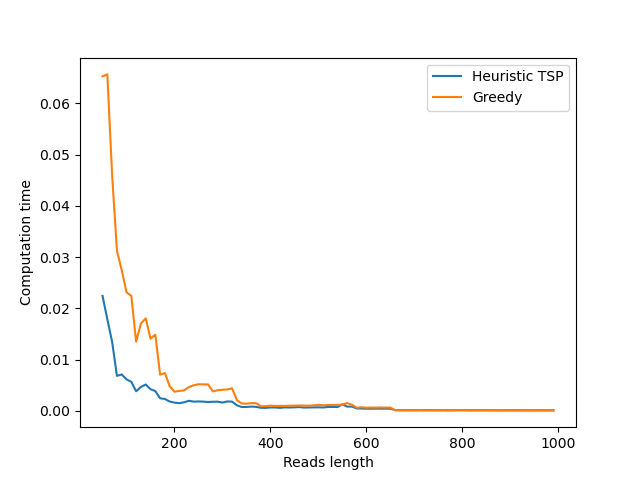

\centering
# BOX HW3
\raggedright

# Notes about the implementation of greedy SCS

We can optimize certain parts of the algorithm. For instance, ```w = merge(u, v)``` could avoid recomputing the overlap if we returned the overlap value directly from ```getStringsWithMaximalOverlap```. However, we chose to remain as close as possible to the exercise's pseudocode.

# From openTSP to SCS problem

In this section, we construct an openTSP instance, represented by a fully connected directed graph $G=(V,E)$, from an SCS problem instance defined by a set of strings $S = \{s_1, \dots, s_n\}$. For each string $s_i \in S$ ($1 \leq i \leq n$), we assign a corresponding vertex $v_i \in V$. Since the graph is fully connected, we create a directed edge $(v_i, v_j)\in E$ for every pair of vertices such that $1 \leq i, j \leq n$ and $i \neq j$.The weight of $(v_i, v_j)$ represents the difference between the length of $s_j$ and the overlap between $s_i$ and $s_j$ : $w(v_i, v_j) = |s_j| - \text{overlap}(s_i, s_j)$. Because ```python-tsp``` computes closed Hamiltonian cycles rather than open paths (like the one we constructed), we add a dummy node $v_0$ as a starting node. From $v_0$, we can go to every node $v_i$ via edges weighted by the length $|s_i|$ of the corresponding string. To close the cycle, each node $v_i$ is connected back to $v_0$ by an edge of weight 0.

## Superstring reconstruction

Once the solver returns the optimal cycle we remove the dummy node to extract the optimal openTSP path ($v_{\text{TSP}_0} \rightarrow \dots \rightarrow v_{\text{TSP}_n}$). To reconstruct the shortest common superstring $s^*$, we initialize it with the first string of the path : $s^*=s_{\text{TSP}_1}$. Then : for k from 2 to $n$, we add the non-overlapping part of the next string $s_{\text{TSP}_k}$ to $s^*$.


# Notes about the tsptoCSC implementation

To show that the exact method from ```python-tsp``` cannot scale to larger graphs, we implemented a ```tspToSCS``` function that allows switching between the ```exact``` (dynamic programming) method and a ```heuristic``` approach.

# Notes about the experimentation

For genome experimentation, we choose 100bp reads length (average read size of an Illumina).

For a one thousand length prefix of ```genome.fa``` :

- Greedy method: Finishes quickly and successfully reconstructs the sequence.
- Heuristic method : Finishes, but the final length is not equal to the length of the chosen prefix because the local search algorithm gets trapped in local minima.
- Exact method: Doesn't finish because of the combinatorial explosion. The dynamic programming approach has a time complexity of $O(n^2 2^n)$. While it guarantees the optimal Hamiltonian cycle and perfectly assembles small instances, the number of vertices generated by simulating a large prefix vastly exceeds the threshold.

## Read size impact

To evaluate the read size impact, we varied the length of the reads from 50 to 1000 bp with a step of 10. Analyzing the assembly accuracy, the graph demonstrates that the greedy algorithm is robust, consistently reconstructing the optimal sequence regardless of the initial read size. The TSP heuristic struggles significantly with smaller reads, artificially increasing the sequence length up to over 2000 bp. It only achieves accurate results when the read length exceeds 600. While the greedy approach requires slightly more time for very small reads due to the extensive overlap comparisons, both execution times rapidly decrease and become perfectly equivalent from a read length greater than 400.





