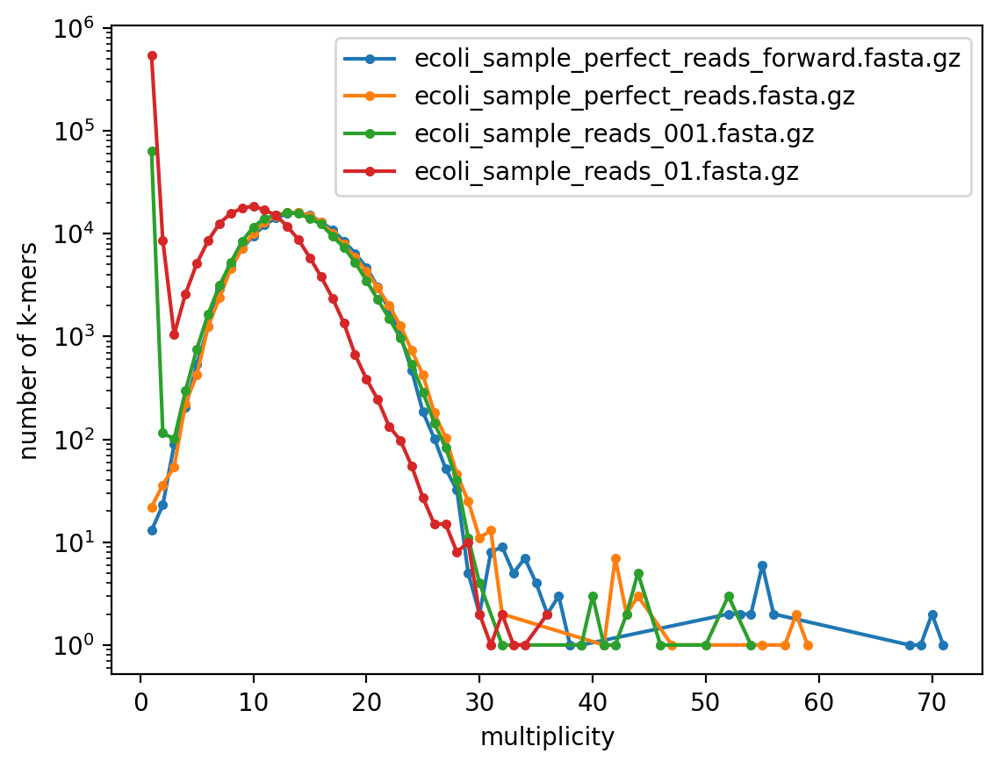

\centering
# BOX HW4
\raggedright

# Minimal information for a node-centric de Bruijn graph

For a node-centric de Bruijn graph of order k, the minimal information needed is the set of k-mers, which are the vertices. Edges do not need to be stored, they can be recomputed at any moment.

To account for both strands, we store only the canonical form of each k-mer, and canonicalize every k-mer before a membership test. One entry thus represents both strands, which halves the memory needed.

In practice, we store a dictionary mapping each canonical k-mer to its number of occurrences rather than a plain set. The keys are still the vertices, so no information is lost, and the multiplicities are needed later. Python's `Counter`, a dictionary subclass designed for counting, is well suited here for counting occurrences.

# Multiplicity of the k-mers
| Fasta file | k-mers processed | Distinct k-mers |
|:--------|-----------------:|-------------------------------:|
| Perfect reads, forward | 2100000 | 149 866 |
| Perfect reads, both strands | 2100000 | 149 869 |
| 0.1% errors | 2100000| 213 031 |
| 1% errors | 2100000 | 702 101 |

The multiplicity distribution has two parts. The perfect datasets show a single bell centered around 13-14, and a thin tail beyond 30 corresponding to repeated regions of the genome. The erroneous datasets add a large peak at multiplicity 1, made of k-mers created by sequencing errors. At 1%, the bell is also shifted to the left.

# Threshold t values

On the erroneous reads, most k-mers seen only once are sequencing errors: the multiplicity histogram shows a peak at 1, clearly separated from the bell of true k-mers (centered around 13-14). Using the graph of the perfect reads as ground truth, false positives (erroneous k-mers kept) drop from 552 239 at t=1 to 8 219 at t=2 and 20 at t=3 for the 1% dataset (63 163, 76 and 0 for 0.1%), while false negatives (true k-mers lost) grow by a factor of about 2 to 4.5 per step (113, 513 and 1 538 for t=2, 3, 4 at 1%).

I choose t=3, which minimizes false positives + false negatives on both datasets (56 for 0.1%, 533 for 1%). At t=4 all false positives are gone but three times more true k-mers are lost (1% dataset), whereas at t= 2 thousands of errors remain. The 20 remaining false positives at t=3 (1% dataset) are likely errors repeated at least three times, which no threshold can separate from true k-mers. The best t also depends on the coverage.

# Recovering unitig

## Algorithm, some principles

- Two way search: The function builds the unitig by exploring the graph to the right and to the left
- Stopping at branches: It stops when a node has more than one successor, or if the successor has more than one predecessor
- Avoiding cycles: It stops if it finds a k-mer that was already visited, to prevent cycles

## Results

Size (in bp) of the unitig containing the given 31-mer.

| Dataset | $t=1$ | $t=2$ | $t=3$ | $t=4$ |
|:--------|------:|------:|------:|------:|
| Perfect reads, forward only | 5 586 | 5 575 | 5 574 | 5 567 |
| Perfect reads, both strands | 5 588 | 5 581 | 3 243 | 3 243 |
| 0.1% errors | 46 | 4 811 | 5 581 | 5 332 |
| 1% errors | 31 | 757 | 3 095 | 2 243 |

On the perfect datasets, the unitig is nearly identical for both at t=1 and 2, which also checks the handling of both strands. It covers only about 4% of the 150 kbp region, so without errors it is most likely a repeat creating a fork (not verified). It decreases when t increases, because true k-mers of low multiplicity are removed, and each removal cuts the path.

On the datasets with errors, we see two effects. At low t, erroneous k-mers create forks that stop the unitig almost immediately (46 bp and 31 bp at t=1). When t increases, the false positives disappear and the unitig grows: 5 581 bp at 0.1% for t=3, identical to the perfect reads at t = 2 ! The size is therefore maximal around t=3, the threshold chosen. However, a single missing k-mer is enough to cut the unitig, so this size depends on the sample of reads. With 1% errors, about 27% of k-mers contain an error (against 3% at 0.1%), so the unitig stays shorter for every t than at 0.1% and never exceeds 3 095 bp.

# Sum of the size of the recovered unitigs

| Dataset | $t=1$ | $t=2$ | $t=3$ | $t=4$ |
|:--------|------:|------:|------:|------:|
| Perfect reads, forward | 150 496 | 150 483 | 150 490 | 150 701 |
| Perfect reads, both strands | 150 499 | 150 477 | 150 531 | 150 687 |
| 0.1% errors | 419 101 | 150 888 | 150 683 | 150 822 |
| 1% errors | 2 233 421 | 194 095 | 152 526 | 155 321 |

On the perfect reads, the total size is about 150.5 kbp, whatever the threshold. At t = 1 the datasets with errors give much larger totals (419 kbp at 0.1%, 2.23 Mbp at 1%). This is not additional genome: erroneous k-mers form thousands of short unitigs, each adding its own overlap. The total drops at t=2 and is minimal at t=3 for both datasets, which confirms (again) the choice of Q7. It increases again at t=4 because true k-mers with low multiplicity are removed.